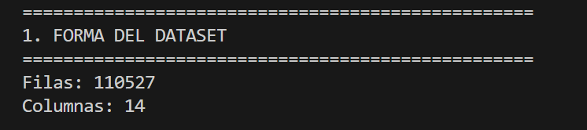
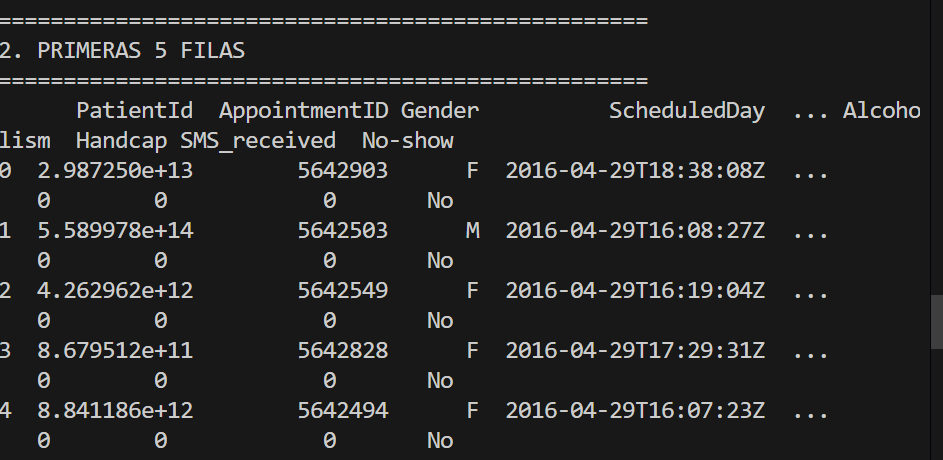

# 🏥 Medical Appointment No-Show Analysis

**Course:** IBM Data Science Professional Certificate - Course 1  
**Date:** 2026-02-13  
**Dataset:** 110k+ medical appointments (Brazil)

## 📸 Development Log

### Step 1: Dataset Overview
First look at the data structure - 110,527 appointments with 14 features.

*Figure 1: Initial exploration showing 110k rows. In my clinical practice, 
this volume represents approximately 5 years of appointments in a medium-sized 
oncology clinic.*
*Figure 2: preview of data structure

### Step 2: Data Types and Missing Values
Checking for data quality issues before analysis.

*Figure 3: Data types review. Note: No missing values detected

### Step 3: Descriptive Statistics
Understanding the distribution of numerical variables.

*Figure 3: descripcion of numerical types.
## 🔍 Clinical Insights

| Finding | Clinical Context |
|---------|------------------|
| Age range: -1 to 115 | Negative ages indicate data entry errors - common in busy clinics |
| Mean age: 37 years | Younger population than my oncology practice (typically 60+) |
| No null values | Unusual for real-world clinical data |

## 📝 Code

See [lab_1_IBM.py](lab_1_IBM.py) for full implementation.
